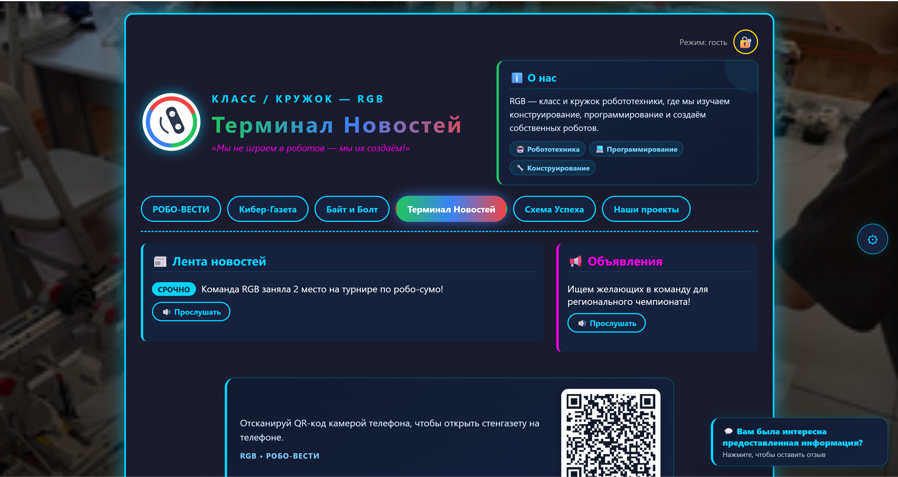

# 🤖 РОБО-ВЕСТИ — стенгазета класса робототехники RGB

Интерактивная веб-стенгазета учебного проекта **RGB** — класса и кружка робототехники.
Проект живёт на GitHub Pages, хранит контент в Supabase, умеет читать новости голосом, считать просмотры и играть в мини-игру «Робот-лабиринт».

---

## ✨ Что умеет

- 🎨 **Кастомные темы** — тёмная, светлая и бесконечные пользовательские
- 📝 **Админ-панель** — редактирование текста прямо на странице (пароль в `index.html`)
- 📸 **Фото недели и проекты** — загрузка через Supabase Storage
- 🔊 **Голосовое чтение новостей** — Web Speech API (заголовок + текст)
- 🎮 **Мини-игра «Робот-лабиринт»** — бесконечные уровни, случайная генерация, свой SVG-робот
- 📊 **Счётчик просмотров** — обезличенный, с антиспамом 30 сек
- 📱 **QR-код и A4-плакат** для печати — `qr-print.html`
- 🥚 **Пасхалки** — 5 кликов по логотипу и 🤖 в футере
- 💬 **Форма обратной связи** — FormSubmit с капчей и honeypot
- 🍪 **КУКИ-баннер** — честная политика без сбора данных

---

## 🛠 Стек

- **Frontend:** чистый HTML / CSS / JavaScript (без фреймворков)
- **Backend / Storage:** [Supabase](https://supabase.com/)
- **Форма обратной связи:** [FormSubmit](https://formsubmit.co/)
- **QR-библиотека:** [qrcodejs](https://github.com/davidshimjs/qrcodejs) (через jsDelivr)
- **Хостинг:** GitHub Pages

---

## 📁 Структура
school-magazine/
├── index.html ← главная стенгазета
├── cookies.html ← политика cookie (в стиле КУКИШ)
├── security.html ← политика безопасности
├── qr-print.html ← A4-плакат с QR-кодом для печати
├── secret.html ← пасхалка для проверяющего 🤫
├── assets/
│ └── robot.svg ← логотип класса RGB
└── style/
  └── style.css ← все стили проекта

👥 Команда
Класс / кружок: RGB

Разработчик: Седельников Яков

Почта проекта: rgb-profi@yandex.ru

📜 Лицензия
Учебный проект. Свободно используйте код для своих школьных стенгазет. 🖕🍪

КУКИш ВАМ, А НЕ КУКИ!